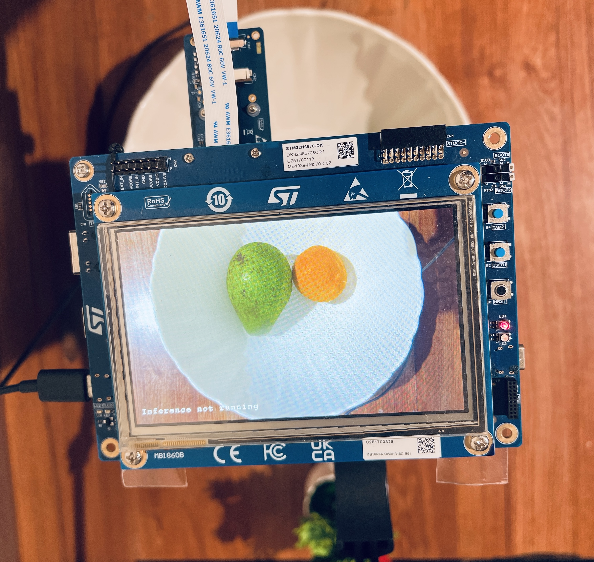

# Real-Time Fruit Detection on the STM32N6 with Edge Impulse

This project demonstrates real-time fruit detection (orange & avocado) running entirely on the STM32N6570-DK — no Linux, no cloud. It uses a YOLO-Pro Pico model trained in Edge Impulse Studio and deployed via ST Neural-ART's relocatable mode, which separates the model weights from the application firmware so you can swap models without reflashing the entire board.

## Hardware & Software

- **Board:** STM32N6570-DK (Cortex-M55 + Neural-ART Accelerator, 4.2MB SRAM, Octo-SPI flash)
- **Model:** YOLO-Pro Pico, trained in Edge Impulse Studio at 160×160 input resolution
- **Deployment:** Three binaries flashed at fixed addresses via STM32CubeProgrammer
  - FSBL: `0x70000000`
  - Application firmware: `0x70100000`
  - Model weights (`network_data.hex`): `0x71000000`

## Getting Started

1. [Download the firmware](https://studio.edgeimpulse.com/studio/870989) from the public Edge Impulse project
2. Follow the [flashing instructions](https://docs.edgeimpulse.com/hardware/boards/stm32n6570-dk) to flash all three binaries in order
3. Flip BOOT1 back left, reset the board, and the inference pipeline starts automatically

> **Power tip:** Before your first run, connect CN8 for supplemental power and move jumper JP2 to 3-4.5V_USB_STLK. The camera, Cortex-M55, and Neural-ART Accelerator together draw more current than a standard USB data port reliably delivers — brownouts and random resets are the symptom if you skip this.

## Updating the Model

To swap in a new model, only reflash `network_data.hex` at `0x71000000`. The application firmware stays untouched.

## References

- [Edge Impulse STM32N6570-DK Docs](https://docs.edgeimpulse.com/hardware/boards/stm32n6570-dk)
- [STM32N6 Getting Started Object Detection](https://github.com/STMicroelectronics/STM32N6-GettingStarted-ObjectDetection/tree/main)
- [STM32N6 FSBL Load and Run Guide](https://community.st.com/t5/stm32-mcus/how-to-create-an-stm32n6-fsbl-load-and-run/ta-p/768206)
- [Getting Started Webinar](https://www.youtube.com/watch?v=u1bDyDm961g)
- [Neural-ART Accelerator Edge Impulse Webinar](https://www.edgeimpulse.com/all-events/getting-started-with-machine-learning-on-the-stm32n6-with-edge-impulse)
